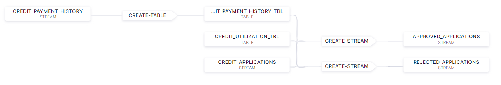

## Introduction

A simple credit application approval demo in KsqlDB

Credit applications are either approved or rejected based on a customers payment history (>90% on-time) and their overall credit utilization (<30%)



## Usage

* Launch a KsqlDB Application in Confluent Cloud

* Create API Keys and copy the client config stub from "Tools & client config" | "Python" from within Confluent Cloud. Save these details to local configuration file

* Install the nessesary Python packages

```
pip3 install -r requirements.txt
```

* Run the Python producer

```
python ./producer.py -f <CCloud Configuration file>
```

This will create the nessesary topics, seed them with data and start producing customer credit application events until the script is killed. 

* Copy & Paste the contents of demo.ksql into the editor inside the KsqlDB application. Click Run Query.

* Query the `APPROVED_APPLICATIONS` & `REJECTED_APPLICATIONS` streams to confirm it is working ok.

## Tear Down

* Kill the Python producer script

* Delete the KsqlDB application in Confluent Cloud

* Manually delete the topics in Confluent Cloud


